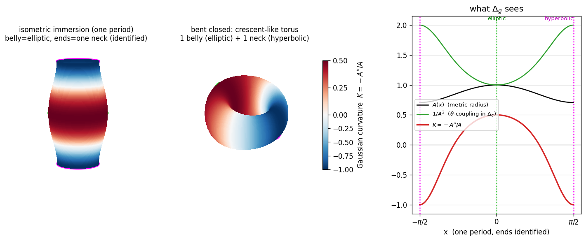
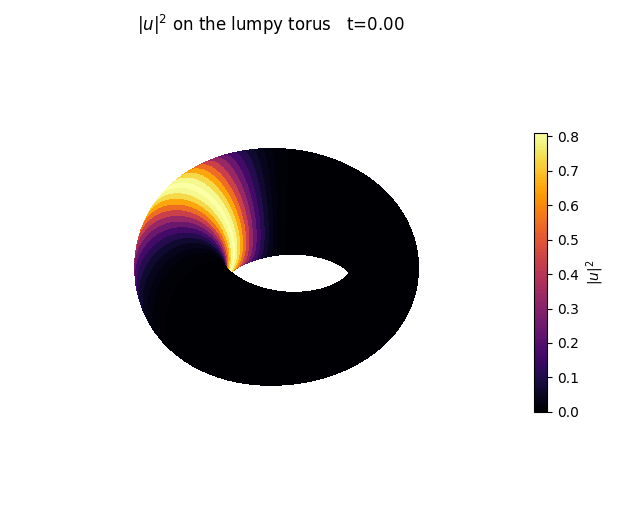
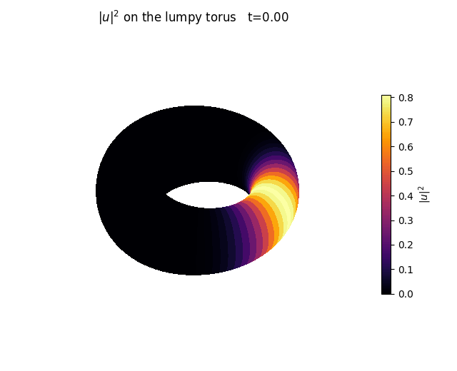
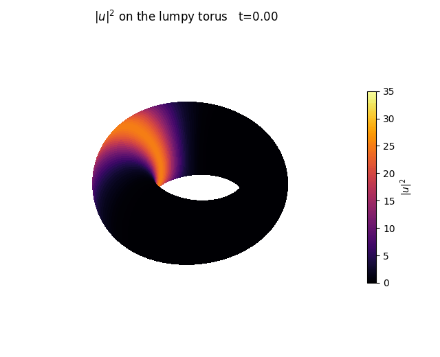

# NLS on the lumpy torus — Python companion

Companion solver for <https://smellslike.ml/posts/nls-on-the-lumpy-torus/>.
Solves the nonlinear Schrödinger equation on the surface of revolution with
intrinsic metric `ds² = dx² + A(x)²dθ²`, `A(x) = √((1+cos²x)/2)`:

```
i u_t = -Δ_g u + σ|u|ᵖu ,   (x,θ) doubly periodic
Δ_g u = u_xx + (A'/A)u_x + (1/A²)u_θθ
```

Pure NumPy/SciPy — no FreeFEM needed.

**Gallery:** [`index.html`](index.html) — the full captioned gallery (open locally,
or serve via GitHub Pages for a shareable link). Preview:



| elliptic geodesic (stable) | hyperbolic neck (unstable) | focusing → collapse |
|:--:|:--:|:--:|
|  |  |  |

## Improvements over the reference `nls.edp`

| reference `.edp` | here |
|---|---|
| fixed 3 fixed-point iters, no check | Picard **with residual convergence check** (+ prefactorized linear op) |
| `adaptmesh` result never assigned back (dead code) | fixed periodic grid, exact double periodicity |
| `rmax[step]` off-by-one (out-of-bounds) | clean history arrays |
| tracked only `max|u|²` | **mass + energy** conservation diagnostics |
| `σ=5e-5` phase unresolvable on 30 pts | resolvable, labelled params |
| discretization not verified conserving | mass-conserving weak assembly (Hermitian `K`, lumped `M`) |

## Validated

- Stiffness `K` exactly symmetric; lumped mass `M` diagonal, positive.
- **Mass conserved to ~3×10⁻¹³** over 1000 steps (machine precision — CN + gauge-invariant nonlinearity).
- Energy drift bounded at ~2×10⁻⁵ (the expected O(τ²) CN oscillation, no secular growth).
- Picard converges in ~4 iterations/step.

## Run

```bash
python3 nls_lumpy_torus.py --quick   # fast self-test: prints mass/energy drift
python3 render.py                     # production run + figures (~1.5 min)
```

Outputs: `conservation.png`, `nls_chart.gif` (field on the (x,θ) chart),
`nls_lumpy_torus.gif` (localized wavepacket on the 3-D lumpy torus).

`render.py`'s `__main__` runs the **geodesic-stability experiment**: a Gaussian
beam concentrated transverse to a parallel geodesic and uniform along it
(`beam_along_geodesic`), on the elliptic vs hyperbolic geodesic:

- `nls_geodesic_elliptic.gif` — beam on the stable equator `x=0` (A max, K>0):
  stays a confined bright band on the outer belly.
- `nls_geodesic_hyperbolic.gif` — beam on the unstable neck `x=±π/2` (A min,
  K<0): spreads into a broad, dim band.
- `geodesic_comparison.png` — peak `|u|²` and transverse RMS width vs t; the
  elliptic width stays bounded, the hyperbolic width swings ~2× larger.

Why it works: an axisymmetric θ-uniform ring stays in the `e^{ikθ}` sector, so
the dynamics reduce to a 1-D transverse problem with centrifugal potential
`k²/A²` — a **well** at the elliptic equator, a **barrier** at the neck.

## Meridian beam & the semiclassical run (`render_meridian.py`, `render_semiclassical.py`)

A beam concentrated *along a meridian* (`beam_along_meridian`) runs over the
bumps. A meridian is a geodesic but **not a stable one** — its transverse
Jacobi field is `J(x)=A(x)`, so nearby meridians are farthest apart at the belly
(`A=1`) and closest at the necks (`A=0.707`). Hence the beam **focuses
(compresses) at the necks and defocuses (expands) over the belly** — the necks
are the waists (same as a sphere: meridians converge at the poles, diverge at
the equator, though `K>0` throughout). This is the *opposite* of a naive
"`K>0`⇒focus at the belly" reading.

- `meridian_diag.png` — coordinate width `w_θ` (belly ≈ neck, metric factor
  hidden) vs physical width `A·w_θ` (belly ≈ 1.45× the necks).
- `render_semiclassical.py` — a genuine semiclassical beam (`q=20`, `w₀≈0.32`,
  `160×224` grid, linear) launched at the belly and surfing the meridian loop.
  `semiclassical_breathing.png` shows the physical transverse width tracking
  `A(beam)` — pulsing narrower at each neck, wider over each belly — on top of
  an overall diffractive spread (the beam delocalizes over ~5 transits, since a
  meridian doesn't confine). GIFs: `nls_semiclassical_{chart,torus}.gif`.
  Mass and energy conserved to ~10⁻¹⁵ (linear CN).
- `render_semiclassical_hires.py` — pushed further in (`q=40`, `300×300` grid,
  `dt=10⁻⁴`, one-time sparse factorization of the 90k system). The breathing is
  crisper and locked to `A(beam)`, with a clear **focal brightening at the first
  neck** (`peak |u|²` 1.0→1.22 before diffraction spreads it over later
  transits). `semiclassical_hires_breathing.png`,
  `nls_semiclassical_hires_{chart,torus}.gif` (torus rendered at `stride=2`).

## Focusing nonlinearity: self-trapping the quasimode (`render_selftrap.py`)

Can a focusing beam self-trap against diffraction? It depends on the geometry,
because focusing cubic NLS is **mass-critical in 2-D**:

- **Meridian** — no stable self-trapping. With no transverse trap the beam is a
  2-D critical soliton (Townes, unstable): `amp≲4` disperses, `amp≈5` **collapses**
  (`peak→∞`, Picard stalls by `t≈0.5`). No stable window.
- **Elliptic equator** — self-trapping works. A θ-symmetric ring `φ(x)e^{ikθ}`
  stays in the `e^{ikθ}` sector → reduces to **1-D focusing NLS in x** with the
  centrifugal well `k²/A²` → *subcritical*, stable solitons. Focusing holds the
  ring tighter and higher than the linear whispering-gallery mode; near `amp≈5`
  the transverse width **locks** into a soliton (~0.21, vs the linear mode
  breathing 0.25↔0.55) until the ring's azimuthal instability triggers collapse
  near `t≈2` — the mass-critical threshold.

`selftrap_comparison.png` (width & peak, linear vs focusing at the stable amp=3),
`nls_selftrap_{linear,focusing}_torus.gif`. The `amp=5` run
(`render_selftrap_collapse.py`) is the dramatic one: transverse width **locks**
at ~0.21 (peak steady ~25) while the azimuthal symmetry-breaking grows
*exponentially from machine roundoff* (`10⁻¹⁵→10⁻¹`, straight line on a log axis
— textbook modulational instability) until it fragments the ring into hot spots
and collapses at `t≈1.8`. `selftrap_collapse.png`,
`nls_selftrap_collapse_torus.gif` (colormap capped at 35 so the locked phase
stays readable). Note: the semiclassical IC in
`render_semiclassical*.py` is a localized *wave-packet* (Gaussian blob); a proper
Gaussian *beam* is narrow-transverse + extended-along-geodesic — that's
`beam_along_geodesic` / `beam_along_meridian`, used here.

## Subcritical power — does the meridian beam self-trap? (mostly no)

Subcritical focusing (`p<2`) removes the collapse (peak stays bounded), but a
launched Gaussian does **not** self-trap into a compact surfing beam:
`p=1` disperses; `p=1.5` relaxes to a **broad breather** (`r_eff→2`, filling much
of the domain) at every amplitude tried; near-critical `p=1.8` at high amp
**over-focuses to the grid scale** and blows up numerically. Subcritical solitons
here are broad (A varies only 30%), and a Gaussian doesn't cleanly form one. The
one place self-trapping genuinely works is the θ-symmetric **equator ring**
(above) — because it reduces to 1-D and is subcritical there. A compact meridian
soliton would need the exact ground-state profile (imaginary-time relaxation).

## 3-D immersion & curvature (`curvature_view.py`)

`curvature_view.png` makes the intrinsic geometry visible, over **exactly one
period** `x∈[−π/2,π/2]` (ends identified). That gives exactly **one elliptic**
closed geodesic (belly, `x=0`, `A=1`, `K=+0.5`) and **one hyperbolic** one
(neck, `x=±π/2` — a single circle after identification, `A=0.707`, `K=−1`).
Because `A(x)` is the distance from the axis (never 0), the metric-exact
(isometric) immersion is a surface of revolution `(A cosθ, A sinθ, z(x))`,
`z(x)=∫√(1−A'²)dx` — a single neck–belly–neck bump. Closing it (bending the ends
together, non-isometric) gives an **asymmetric, crescent-like torus** — one
bulge + one waist, not a symmetric multi-lump donut. Panels: (1) the isometric
one-period immersion colored by `K` (green = elliptic belly, magenta = the
identified necks); (2) the bent crescent torus colored by exact `K`; (3) the
operator inputs `A`, `1/A²` (θ-coupling in `Δ_g`, peaks at the necks), `K` vs `x`.

## Tunables

In `render.py` `__main__` / `initial_condition(...)`:
`sigma` (±1 focusing/defocusing), `p` (power; 2 = cubic, mass-critical in 2-D),
`amp`, beam center `xc,thc`, widths `wx,wth`, integer θ-momentum `k`, grid
`Nx,Nth`, `dt`, `T`.

**Embedding note:** `torus_embedding` in `render.py` is the **crescent
immersion** built on the metric-faithful profile `(A(x), z(x))`,
`z=∫√(1−A'²)dx`, over one period bent closed: the field coordinate `x` (belly
`x=0` ↔ neck `x=±π/2`) maps to the toroidal angle `Φ(x)`, `θ` is poloidal, and
`A(x)` is the poloidal tube radius — so the torus is fat at the belly and
pinched at the neck (one bulge + one waist). It's non-isometric in shape (true
closure is the open barrel) but preserves the one-elliptic/one-hyperbolic
geometry. All `*_torus.gif` render on it.

## Possible next steps

- True **Newton** for the nonlinearity (real-split `δū` Jacobian) — faster than
  Picard near strong concentration; derivation in hand.
- **Discrete-gradient** (Delfour–Fortin–Payre) nonlinear term → energy conserved
  to machine precision too.
- Match the post's exact IC/parameters; or a supercritical `p=8` blow-up study.

## Background & references

The experiment sits on a well-worn thread of geometry and physics.

**The reduction that grounds it.** Separating `u = e^{ikθ}φ(x)` turns the
Laplace–Beltrami operator into a 1-D Schrödinger operator with effective
potential `V_k(x) = k²/A²` — a well at the belly, barriers at the necks: the same
centrifugal barrier as the radial equation in atomic physics. Its bound states
are the whispering-gallery quasimodes (`quasimode_ladder.png`). Classically, the
integrable geodesic flow (Clairaut's relation `A²θ' = const`) has the *identical*
`L²/A²` effective potential — an elliptic island around the belly, a separatrix
at the neck (`geodesic_phase_space.png`).

- **Whispering-gallery modes** — Lord Rayleigh, *The Problem of the Whispering
  Gallery* (1910); realized in ultra-high-Q optical microtoroid resonators:
  Armani, Kippenberg, Spillane & Vahala, *Nature* **421**, 925 (2003).
- **Quasimodes / Gaussian beams on stable geodesics** — Ralston, *Comm. Math.
  Phys.* **51**, 219 (1976); Babich & Buldyrev, *Asymptotic Methods in
  Short-Wavelength Diffraction Theory*.
- **NLS on manifolds** — Burq, Gérard & Tzvetkov, *Amer. J. Math.* **126**, 569
  (2004).
- **Self-trapping, necklaces, collapse** — the self-trapped ring and its
  azimuthal breakup are the "necklace beam" instability: Soljačić, Sears & Segev,
  *Phys. Rev. Lett.* **81**, 4851 (1998); the mass-critical blow-up has a
  universal profile: Merle & Raphaël, *Invent. Math.* **156**, 565 (2004).
- **Attractive BEC analogue** — the focusing NLS is the Gross–Pitaevskii
  equation; the self-trapped ring is a bright matter-wave soliton and the
  collapse a "Bosenova": Donley et al., *Nature* **412**, 295 (2001).
- **Revivals** — a packet on the belly ring reforms at rational fractions of the
  revival time (the Talbot effect): `spacetime_carpet.png`.

Source study: <https://smellslike.ml/posts/nls-on-the-lumpy-torus/>.
